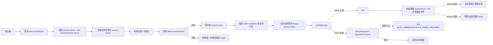

# AUTH FLOW

## 统一响应格式（401 / 403）

```json
{
  "success": false,
  "message": "需要管理员权限",
  "error": {
    "code": "AUTH_ADMIN_REQUIRED",
    "message": "需要管理员权限"
  }
}
```

- `401`：登录态无效（缺失 token / token 过期 / token 篡改 / 用户不存在）
- `403`：已登录但无权限（管理员权限不足、试用过期等）

## 认证流程图



## 三条链路

1. 登录链路
- 前端登录成功后只保存 token（不再持久化完整 user 对象）。
- 随后立即请求 `/api/v1/auth/me`，后端返回当前真实用户态。

2. 刷新页面链路
- 前端不落盘 access token，页面刷新后 token 会丢失。
- 启动时先调用 `/api/v1/auth/refresh`，由 HttpOnly Cookie 携带 refresh token 自动换新 access token。
- refresh 成功后再调用 `/api/v1/auth/me` 恢复用户态；失败则回到登录页。

3. 过期退出链路
- 非鉴权接口返回 `401` 时，前端会先静默调用一次 `/api/v1/auth/refresh`：
  - refresh 成功：自动重放原始请求，用户无感
  - refresh 失败：再执行统一登出清理并跳转 `/login`
- 统一登出清理包括：内存 token、activeUserId、本地游戏 token 缓存、连接态。
